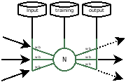

# HXE

HXE - Host eXecution Engine

A powerful host-based process execution engine with JWT authentication, comprehensive API, and beautiful client interfaces.

[](https://golang.org)
[](LICENSE)
[](https://goreportcard.com/report/github.com/rangertaha/hxe)

## Features

- 🔐 **JWT Authentication**: Secure authentication with token-based access
- 🚀 **Program Management**: Start, stop, restart, and monitor programs
- 🖥️ **Desktop App**: Modern web-based UI for program management
- 💻 **Command Line App**: Full-featured CLI with beautiful table formatting
- 🔧 **Configuration**: HCL-based configuration files
- 📊 **Monitoring**: Real-time program status and logs
- 🔄 **Auto-restart**: Automatic program recovery on failure
- 🌐 **RESTful API**: Comprehensive API with JWT protection
- 📝 **Logging**: Comprehensive logging with multiple levels
- 🎨 **Beautiful UI**: Table formatting with go-pretty library
- 🔄 **Multi-operations**: Bulk operations for multiple programs
- 🌍 **Cross-platform**: Works on Linux, Windows, and macOS

## Screenshots

### Desktop Interface


### Terminal Interface


## Installation

### Prerequisites

- Go 1.23 or higher
- Git

### From Source

```bash
# Clone the repository
git clone https://github.com/rangertaha/hxe.git
cd hxe

# Build the project
go build -o bin/hxe ./cmd/hxe

# Install globally (optional)
sudo cp bin/hxe /usr/local/bin/
```

### Using GitHub Packages

HXE is available as a Go module from GitHub Packages:

```bash
# Configure Go to use GitHub Packages
export GOPRIVATE=github.com/rangertaha/hxe
export GOPROXY=https://proxy.golang.org,direct

# Install HXE
go install github.com/rangertaha/hxe/cmd/hxe@latest

# Or add to your project
go get github.com/rangertaha/hxe/pkg/client
```

### Using Make

```bash
# Build backend server
make server

# Build desktop application
make desktop

# Clean build artifacts
make clean
```

## Quick Start

### 1. Start the Server

```bash
# Start the HXE server
hxe --daemon

# Or with custom configuration
hxe --config /path/to/config.hcl --daemon
```

### 2. Using the Go Client

```go
package main

import (
    "log"
    "github.com/rangertaha/hxe/pkg/client"
)

func main() {
    // Create authenticated client
    hxeClient := client.NewAuthenticatedClient("http://localhost:8080", "admin", "password")
    
    // Login to get JWT token
    _, err := hxeClient.Login()
    if err != nil {
        log.Fatal("Login failed:", err)
    }
    
    programClient := hxeClient.Program
    
    // List all programs
    programs, err := programClient.ListPrograms()
    if err != nil {
        log.Fatal("Failed to list programs:", err)
    }
    
    // Display programs in beautiful table format
    programClient.PrintList(programs)
    
    // Create a new program
    newProgram := &models.Program{
        Name:        "My Program",
        Description: "A test program",
        Command:     "/usr/bin/python3",
        Args:        "script.py",
        Directory:   "/tmp",
        User:        "nobody",
        Group:       "nobody",
        Enabled:     true,
    }
    
    created, err := programClient.CreateProgram(newProgram)
    if err != nil {
        log.Fatal("Failed to create program:", err)
    }
    
    // Start the program
    _, err = programClient.StartProgram(created.ID)
    if err != nil {
        log.Fatal("Failed to start program:", err)
    }
    
    // Logout when done
    hxeClient.Logout()
}
```

### 3. Command Line Interface

```bash
# List programs
hxe list

# Start a program
hxe start my-program

# Stop a program
hxe stop my-program

# Get program status
hxe status my-program

# Run a command directly
hxe run "python3 script.py"
```

## Configuration

HXE uses HCL (HashiCorp Configuration Language) for configuration files. The default configuration is created at `~/.config/hxe/config.hcl`.

### Basic Configuration

```hcl
// HXE Configuration
debug = false
version = "0.1.0"

api {
  addr = "0.0.0.0"
  port = 8080
  username = "admin"
  password = "password"
}

database {
  type = "sqlite"
  migrate = true
}

broker { 
  name = "hxe"
  addr = "0.0.0.0"
  port = 4222
}
```

## API Reference

### Authentication

HXE uses JWT authentication. Default credentials:
- **Username**: `admin`
- **Password**: `password`

### REST Endpoints

#### Authentication
- `POST /api/auth/login` - Login and get JWT token
- `POST /api/auth/refresh` - Refresh JWT token
- `POST /api/auth/logout` - Logout

#### Programs
- `GET /api/program` - List all programs
- `GET /api/program/{id}` - Get program details
- `POST /api/program` - Create a new program
- `PUT /api/program/{id}` - Update a program
- `DELETE /api/program/{id}` - Delete a program
- `POST /api/program/{id}/start` - Start a program
- `POST /api/program/{id}/stop` - Stop a program
- `POST /api/program/{id}/restart` - Restart a program
- `POST /api/program/{id}/enable` - Enable a program
- `POST /api/program/{id}/disable` - Disable a program
- `POST /api/program/{id}/reload` - Reload program configuration
- `POST /api/program/{id}/shell` - Open shell for a program
- `POST /api/program/{id}/tail` - Follow program logs

### Client Library

The HXE client library provides a comprehensive Go API:

```go
// Create authenticated client
client := client.NewAuthenticatedClient("http://localhost:8080", "admin", "password")

// Login
_, err := client.Login()

// Get program client
programClient := client.Program

// CRUD operations
programs, _ := programClient.ListPrograms()
program, _ := programClient.GetProgram("123")
created, _ := programClient.CreateProgram(newProgram)
updated, _ := programClient.UpdateProgram("123", program)
deleted, _ := programClient.DeleteProgram("123")

// Runtime operations
_, _ = programClient.StartProgram("123")
_, _ = programClient.StopProgram("123")
_, _ = programClient.RestartProgram("123")
_, _ = programClient.EnableAutostart("123")
_, _ = programClient.DisableAutostart("123")

// Display methods
programClient.PrintList(programs)        // Table view
programClient.PrintDetail(program)       // Detailed view
```

## Usage

### Command Line Options

```bash
hxe [OPTIONS] [COMMAND]

Options:
  -d, --daemon    Run in daemon mode
  -c, --config    Configuration file path
  --debug         Enable debug logging
  -h, --help      Show help
  -v, --version   Show version

Commands:
  run             Run a command or program
  list            List all programs
  start           Start a program
  stop            Stop a program
  restart         Restart a program
  status          Show program status
  tail            Tail program logs
  reload          Reload configuration
  enable          Enable a program
  disable         Disable a program
  shell           Open shell for a program
```

### Examples

#### Basic Program Execution

```bash
# Run a simple command
hxe run echo "Hello, World!"

# Run a Python script
hxe run python script.py

# Run with arguments
hxe run node server.js --port 3000
```

#### Program Management

```bash
# List all programs
hxe list

# Start a program
hxe start my-program

# Stop a program
hxe stop my-program

# Get program status
hxe status my-program

# Enable autostart
hxe enable my-program

# Disable autostart
hxe disable my-program
```

#### Daemon Mode

```bash
# Start HXE in daemon mode
hxe --daemon

# Start with custom configuration
hxe --config /etc/hxe/config.hcl --daemon
```

## Development

### Project Structure

```
hxe/
├── cmd/hxe/              # Main application entry point
├── internal/             # Internal packages
│   ├── agent/            # Service agent
│   ├── api/              # API server and handlers
│   ├── config/           # Configuration management
│   ├── models/           # Data models
│   └── log/              # Logging utilities
├── pkg/client/           # Go client library
├── desktop/              # Desktop application
├── examples/             # Example configurations and usage
└── docs/                 # Documentation
```

### Building

```bash
# Build for current platform
go build -o bin/hxe ./cmd/hxe

# Build for specific platform
GOOS=linux GOARCH=amd64 go build -o bin/hxe-linux-amd64 ./cmd/hxe
GOOS=darwin GOARCH=amd64 go build -o bin/hxe-darwin-amd64 ./cmd/hxe
GOOS=windows GOARCH=amd64 go build -o bin/hxe-windows-amd64.exe ./cmd/hxe
```

### Testing

```bash
# Run all tests
go test ./...

# Run tests with coverage
go test -cover ./...

# Run specific test
go test ./internal/api
```

## Contributing

1. Fork the repository
2. Create a feature branch (`git checkout -b feature/amazing-feature`)
3. Commit your changes (`git commit -m 'Add amazing feature'`)
4. Push to the branch (`git push origin feature/amazing-feature`)
5. Open a Pull Request

## License

This project is licensed under the GNU General Public License v3.0 or later - see the [LICENSE](LICENSE) file for details.

## Acknowledgments

- Inspired by [Supervisord](http://supervisord.org/), [PM2](https://pm2.keymetrics.io/), and [Systemd](https://systemd.io/)
- Server Built with [Go](https://golang.org/), [Echo](https://echo.labstack.com/), [GORM](https://gorm.io/), and [NATS](https://nats.io/)
- Desktop App Built with [React](https://reactjs.org/), [Tauri](https://v2.tauri.app/), and [Rust](https://www.rust-lang.org/)

## Support

- 📧 Email: rangertaha@gmail.com
- 🐛 Issues: [GitHub Issues](https://github.com/rangertaha/hxe/issues)
- 📖 Documentation: [GitHub Wiki](https://github.com/rangertaha/hxe/wiki)


